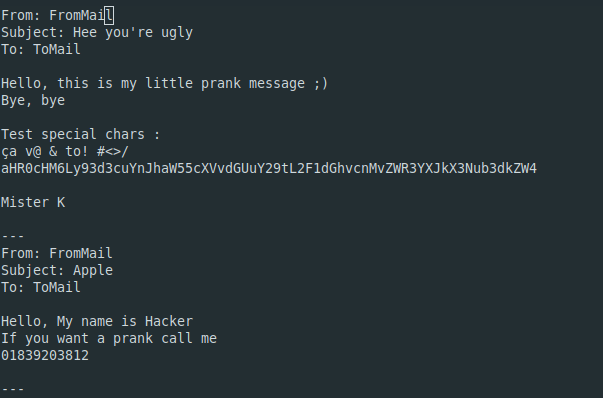

# Laboratory - Usurpation Identity with SMTP

## Laboratory Description ##

In the laboratory, we create an application who will send prank emails to different groups of user email with a "fake email account".

For example, if you want to send to 5 people an email and told him that they won 1 million dollar with email "winner@loto.com" YOU CAN !

## Setting up a mock SMTP Server with Docker

- Go to [https://github.com/tweakers/MockMock](https://github.com/tweakers/MockMock) and do a git clone
- In the MockMock folder you can do a mvn clean install to have the JAR application (target/MockMock-1.4.0.one-jar.jar)
- Copy the JAR application to this application folder (must be in the same folder as Dockerfile)
- Cou can run the command in the file: docker build -t mockmockserver . (/!\ Don't forget the . at the end /!\) 
- Now you can run the container with the command: docker run -i -t mockmockserver
	- The web site is on 172.17.0.2:8282 if it's the first container that you run
	- The email can be send with this ip with the port 25
- Run the application with all good configuration and you will saw emails in MockMock server


## Instruction for configuration

We have 5 files who is important

- MailSender.jar ( or MailSender-1.0-SNAPSHOT-launcher.jar if you compile with maven): this is the application and you can run it from the terminal like this : 

  ```bash
  java -jar MailSender.jar
  ```

- config.properties :  we will have all configuration information

  - SmtpServerAddres: Define the address of SMTP server
  - SmtpServerPort : Define the port
  - Groups : Define the number of groups
  - Login : Define if we need a login (login=true or login=false)

- sender.utg8 : We will have all emails that will send the fake emails

  - Sender are chosen randomly

- receivers.utf8 : We will have all emails that will receive the fake emails

- messages.utf8 : We will have all the message that we want to send to people

  - All messages begin with Subject:

  - All messages are separated with 3 - like this 

  - Message is chosen randomly

     

Finaly, when we are running the java application ALL this files must be in the same folder !!

# Description of implementation


### Class description

**Person** : This class is used to define a person with his email. The email is set with constructor and we have a toString to get email value.

**Group** : This class contains all people in a group of person who will receive emails. We can add and get people

**Groups** : This class contains all groups that will be "pranked". We can add groups and get also.

**Mail** : This class contains All information about Mail (From, To, M)

**ConfigManager** : This class will set all variable with all files configurationwe. The check  files are set there. It check if there is 3 persons pers groups, if there is message(s), sender(s)

**SmtpClient** : This class will send the Mail by protocole SMTP with logs (/!\ if you don't use MockMock or Mailtrap, you can have some problem with the application /!\)

**MailSender** : Main class that will ask the user credential if needed and will run the application

## Demo


The docker is initialise and ready to get SMTP request


We tried to execute the program but there is a problem with a file configuration


At the top left and bottom right we can see that the docker receive the 3 emails. At the bottom left we can see the server answer.

## To be carreful

- This application is working with MockMock and mailtrap server. If you want to use another "fake" SMTP server perhaps you will need to change some parameter in SmtpClient because there is some option about logs that is not the same for an other application.
- This is not an application to "hack" people, it's just for testing or prank people. We are not responsible about that. 

